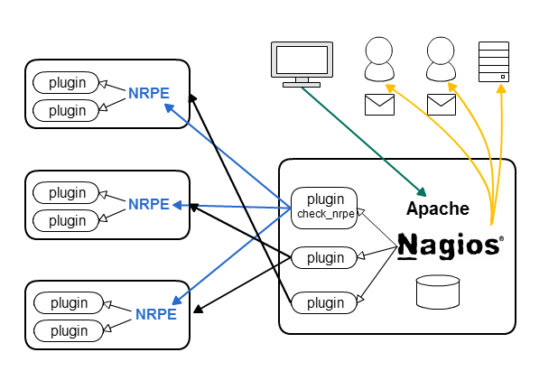

# Nagiosの基礎

この文書は新卒採用エンジニアの研修資料として、アドバンスドシニアエンジニアの黒田 良が社内向けに作成したものです。

## アジェンダ

* Nagios
  * Nagiosってなんすか
  * 設定の基本
  * よくある監視項目
  * ウェブインターフェースの見方、使い方

* Munin
  * Muninってなんすか
  * 何処をどう見たらいいのか

----

# Nagios

何のための監視かは今日はもう説明しない。なぜ開発者がNagiosを学ぶのか?

自分が作った物は自分で面倒見たいのが本音だろう。@kyanny さんがいいこと書いてる。

[お願いします脳の恐怖](http://blog.kyanny.me/entry/2012/07/20/033411)

## サービスモニタリングフレームワーク

nagiosってなんすか?

復数のホスト、サービス、リソース等の状態の監視を効率的に管理するためのもの。

### フレームワーク2大巨頭

* Naigos
  * 設定をテキストファイルで管理
  * データストアもファイル
  * 監視だけ
* Zabbix
  * 設定をRDBMSで管理
  * データストアもRDBMS
  * グラフも作ってくれる

ペパボは全部Nagiosなので、とりあえずNagiosだけ覚えればOK。

### フレームワークなので

インストールしただけでは基本的になにもやってくれません。やってくれることは大きく分けて4つ。

* サービスチェックの実行と、そのスケジューリング
* チェック結果の通知
* 結果の蓄積
* ウェブインターフェースのサーブ

### アーキテクチャ



----

## 設定の基本

設定の自由度が高いので、やり方はいくらでもあります。その割に、ネット上で探しても(それなりの規模での)設定例というのはなかなか見つかりません。今日は現時点で俺がいいと思って実際にやっている設定管理のポイントを交えながら説明していきます。

自分のvm(port 80空いてるやつ)でnagiosをインストールしておいてください。

```
sudo yum install nagios
```

### 設定ファイルの種類

まず大きく分けて、2つに分かれます。

* Nagios自体の設定(フレームワークとしての設定)
* 監視項目の設定(誰の何をどう監視するのか)

### Nagios自体の設定

一般的に`/etc/nagios/`直下に置かれます。

* nagios.cfg
  * インクルードする設定ファイルの場所とか、その他リソースの置き場とか
* cgi.cfg
  * ウェブインターフェースの権限設定とか

これらは最初に設定したらその後触ることは稀です。なので、特に開発者はその詳細を知る必要は無いです(というか俺も初期セットアップ時に毎回忘れて調べてる)。

### 監視項目の設定

こっから重要。

幾つか種類のオブジェクトをファイルに記述し、それらの関連付けを行うという形で、対象ホストや監項目、その内容を定義します。

### ファイルレイアウト

`/etc/nagios/objects/<サービス名>/{hoge.cfg,foo,cfg...}`

* 便宜上オブジェクトタイプごとにファイルを分けているが、全て同じスコープ
  * 極端な話、全部単一のファイルに書いても動く
* ファイル名は自由。関係ないことを設定してもOK
  * でも椅子は飛ぶ
* サービスごとに階層を掘るのが吉
  * 復数商材を同じnagiosで面倒みるってことも有るので、混ぜるな危険

最近はRPMインストール時にnagios/objectが掘られないぽい？

### オブジェクトの種類

覚えて欲しいのはこの4つ。
普通は`<object-type>s.cfg` という名前のファイルにそれぞれを定義します。

* hostgroup
* host
* service
* command

その他にも色々なオブジェクトもありますが、(差し当たって開発者は)あんまり気にしなくていいです。こういうこともコントロール可能なんだ、ってことだけ覚えておいてください。

* contact、contactgroup
  * 通知する相手の情報とグルーピング
* timeperiod
  * 監視、通知する時間帯
* serviceescalation, hostescalation
  * まじやばい時に追加で誰に通知するか
  * これは後で詳しく説明する(かも)

#### template

各オブジェクトの説明の前に。全オブジェクトに共通する性質として、こいつらはinheritableです。

* テンプレートオブジェクト
  * `register`アトリビュートを0にすると、それ自体は単にひな形となる
* 子の`use`アトリビュートでテンプレートオブジェクトを指定して継承
  * 継承を連鎖させる(孫を作る)こともできるけどおすすめしない。むしろすんな
  * staging用サーバとかでちょい変えることはある
* 子は親のアトリビュートの値を継承し、全て上書き可能

#### host

監視対象ホストを定義する。

これと監視項目(service)を結びつけていくわけだけど、ホスト自体の監視という意味もあります(サーバ自体が死んでるとか、NICが死んでるとか)。

* 通常はpingで監視
* 変更は可能

復数のネットワークに属する場合は、別々のhostとして定義するのが吉(not 物理的な単位でのサーバ)。

* (特に)ペパボのサービスはNIC2つを付けて .jp と .lanの2つで運用している
* それぞれでサーブしているサービスは違う(roleの視点でみても厳密には別ものである)
* 実際にそれを使っているクライアントと同じN/Wから監視すべき
  * 外側にさらしているサービスを内側から監視して大丈夫？

hostオブジェクトは自前のスクリプトなどでよく自動生成させるので、直接手編集しないってこともよくあります。

#### hostgroup

hostをなんか意味のある単位で束ねるのに使います。
使わないってことも可能です。でもserviceオブジェクトで対象hostをいちいち全部並べるのはあほらしいので使います。

hostgrouopを束ねたhostgroupというのも作れますが、あんまり使わないです。

hostとgroupの関係は`host has many hostgroup`です。
実は逆もできます。が、しかし。

* 設定ファイルの見通しが悪くなる
* 自動生成(後述)と相性が悪い
* (社内にある酷い設定例を見せる)

なので、hostgoup has many hostは非推奨です。

また、上手くアーキテクチャ設計ができているとき、

* ホストはシステムの中で単一の役割を与えられている
* なにをする(何が動いている)ホストなのかはroleが決まっていれば自ずと決まる

なので、hostは単一のhostgroupに属することが多いです。むやみにhostgroupを増やして、hostと紐付けるのは運用効率を著しく下げる為、NGです。

ただし、役割で分類出来ない場合はマルチhostgroupを許容してします。
例えばH/W構成。

* ssd
* raid-controller
* machine-type

hostgroups.cfgも一部のサービスでは自動生成してます。

#### service

監視項目です。

サービス名やプロセス名、サーバリソース名とかを名称(`service_description`アトリビュート)として付けます。
service_descriptionはアラートに表示される(例えばメールのsubject)ので、他のオブジェクトのnameとくらべて、より人間がぱっと見で分かりやすいものにした方がいいです。

refs [Service Definition](http://nagios.sourceforge.net/docs/nagioscore/3/en/objectdefinitions.html#service)

> may contain spaces, dashes, and colons (semicolons, apostrophes, and quotation marks should be avoided)

監視対象はhostもしくはhostgroup(それぞれ復数可)、またはその二つの組み合わせで指定可能ですが、大抵はhostgroupだけでなんとかなります。hostをだらだら並べるような設定はクソなことがおおいです。

serviceオブジェクトは(他のobjectの`*_name`と違い)下記の2つのアトリビュートの組み合わせで一意であればOKです。

 * `service_description`
 * `host[group]_name`

つまり、対象やcheck_comnnadだけを変えてservice_descriptionは同じの沢山ってのはアリです。なので、例えば
「同じミドルウェアを監視するけど、こっちのroleでは厳密に監視するように(check_commandで定義)して、あっちの方は緩くしておく。」
みたいなことが可能です。

<del>実は、hostやhostgroupオブジェクトの側で、serviceをひもづけることも可能なんですが、</del> うそ。出来なかったです。

#### command

監視の手段とその名前を定義します。

commnad名(`command_name`)はserviceオブジェクトの`check_command`アトリビュートで指定され、serviceをどのcommandでチェックするのか、という関係を作ります。

`command_line`に実際に実行するコマンドを書きます。
コマンドのexit codeでステータス(OK|WARN|CRIT|UNKNOWN)を判別するので、コマンドワンライナーでもなんでもいいんですが、普通はnagiosプラグインを使います。

serviceオブジェクトでcommandを指定する際には、引数(\!区切りで最大32個)も渡せる為、上手くcommnadを定義すれば、新規でやたらと定義を追加するってことを避けれます。

設定に出てくる`$USER1$`ってのはマクロです。pluginの入ったpathが入ってます。下記は使用頻度の高いマクロの一部です。

 * $ARG\<N\>$
 * $HOSTNAME$
 * $HOSTADDRESS$

他にも[一杯あります](http://nagios.sourceforge.net/docs/3_0/macrolist.html)。ARG\<N\>はserviceオブジェクトから渡される引数で、それを更にプラグインへオプション引数として渡すときに使います。あとの2つもプラグインへの引数としてどちらかをほぼ必ず使います。HOSTADDRESSよりはHOSTNAMEを使った方がベターです。HOSTNAMEを使うことで、名前引きのチェックにもなります。

#### nrpe

command(のcommand_line)で`check_nrpe`というnagiosプラグインを使った監視は、他とはちょと違ってserver - agent型で動きます。対象ホスト上で実行しないと、結果が得られない(得にくい)監視をするのに使います。

例えば、メモリの残量なんかはリモートホスト上でfree叩くとか、/proc/meminfoを覗かないとわかんないですよね(snmpという手段もあるけど、あれ俺好きじゃない)。

check_nrpeの引数で、対象ホストの`nrpe.cfg`(エージェントデーモン、nrpeの設定)で定義されているコマンドを指定します。実行結果(exit code)は普通のチェックコマンドと同様に解釈されます。また、コマンドだけでなく、引数もエージェントに渡すことが可能です。

残メモリ監視のcommand設定例

```
define command {
    command_name    check_mem
    command_line    $USER1$/check_nrpe -H $HOSTNAME$ -t 60 -c check_mem -a $ARG1$ $ARG2$
}
```

nrpe.cfg側

```
command[check_mem]=/usr/lib64/nagios/plugins/check_mem -f -w $ARG1$ -c $ARG2$
```

commandオブジェクトの方で、serrviceオブジェクトから受け取った閾値を、今度はcheck_nrpeに渡してします。それが最終的にnrpeのcommandとして定義されたcheck_memに渡されて実行されます。

このように、nrpeを使った監視でも引数を上手く使うことで、設定をコンパクトに保つことができます。


#### nagiosプラグイン

RPMで入る標準pluginはここにあります。

```
/usr/lib[64]/nagios/plugins/
```

ここに無いものは`yum search nagios-plugins`したり、[Nagios Exchange](http://exchange.nagios.org/)で適当なキーワードで検索したりして、それっぽいものが無いか探します。

それでも無かったら、自作。
ペパボでも自前で作ったやつは誰でも変更出来るようになっています。

慣れれば簡単につくれます。

----

## よくある監視項目

社内で使われている puppet マニフェストをみながら、あーだこーだ話す。

----

## ウェブインターフェース

Apacheをフロントエンドにしてるので、RPMを入れると勝手にconf.d/nagios.confが出来て、http://mydomain.com/nagios/ で見れるようになります。

使い方はポチポチ押してたら、なんとなく分かります。

### よくやるオペレーション

#### Schedule downtime

Zzzマークでお馴染み。

「これダウンタイムいれといてー。」とか「あーダウンタイム設定しわすれてたわ。」とかいう会話を今後よく聞くことになると思います。それがこれ。

メンテ等で事前に監視がパスしないことがわかっている場合に、任意の期間、通知を停止させることできます。
特定ホストのservice全部を対象にすることも可能です。やり方は適当にその辺のインフラの人に聞いてください。

似た機能で`Disable notifications`ってのがありますが、こっちは **よほどの事が無い限りポチらないでください**。
Schedule downtimeは時間がたてば勝手に解除されますが、こちらはそれがありません。手動で解除するしかないです。

その為「メンテ前にポチってやってメンテ終わったけど解除忘れてた。」なおっちょこちょいをすると、後日本当に障害が起きてもそのホストは気づかれることなく放置されてしまいます(昔実際にあった)。


#### Schedule a check of all services on this host

若しくは、`Re-schedule the next check of this service`。

腕時計マークでお馴染み。

何かしらの理由でチェックがコケた後に、調査して原因となる問題を取り除いたら、とっととnagiosでの再チェックを行いたい時があります。

そんな時にこれをポチっと押すと、優先的にチェックをして、statusを更新してくれます。

#### ホスト検索

wan、lanどっちも検索する時は`hogehost.*`するとどっちも出て便利。

----

## 運用

設定の管理方法がサービスごとにわりとまちまちです。主に、

* リポジトリをpuppetと同じにしてるか、別にしてるか
* hosts.cfg、hostgroup.cfgを自動生成にしているか否か

の2点で違います。リポジトリの方は、更新頻度とか規模によって変えてます。更新頻度が高いのはwebistranoでnagios設定だけをデプロイするようにした方が運用が楽だったりとかそんな理由です。

自動生成というのは、ホスト数が多くなると手編集でミスとかするのアホらしいので、ホストとかロール名を外部データソースからひっぱってきて、スクリプトでテンプレ当てるって感じです。
AWS使ってる場合はAPIで取れるsecutity groupやroleタグをデータソースに使います。

自動生成の例は[ここ](http://d.hatena.ne.jp/lamanotrama/20120618/1339988584)みてください。

----

## アドバンストNagios

某H社には、他のフレームワークと組み合わせて設定管理をとんでもないレベルで自動化したり、大規模環境に合せて分散処理したりとかやってる[すごいやつ](http://shoichimasuhara.hatenablog.com/entry/2013/03/11/184422)がいる(元自衛官)。

## 参考資料

[本家ドキュメントサイト](http://nagios.sourceforge.net/docs/nagioscore/3/en/toc.html)

[Nagios統合監視[実践]リファレンス](http://www.amazon.co.jp/Nagios%E7%B5%B1%E5%90%88%E7%9B%A3%E8%A6%96-%E3%83%AA%E3%83%95%E3%82%A1%E3%83%AC%E3%83%B3%E3%82%B9-Software-Design-%EF%BD%90lus/dp/4774145823)

ほぼ唯一日本語で網羅的に解説された書籍です。インフラエンジニアは買った方がいい。
